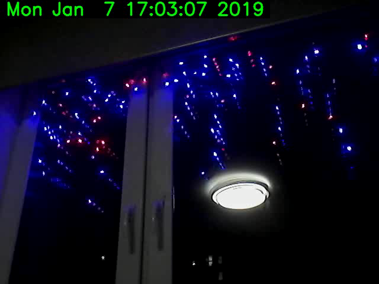

# videoLogger
recording video archive with reference to time  h264  python opencv

## Requirements
openCV

## Usage
Set number youre camera 
```
cap = cv2.VideoCapture(0)

```
Run
`pyhon videoLogger.py`

The video file will be saved to the current directory



